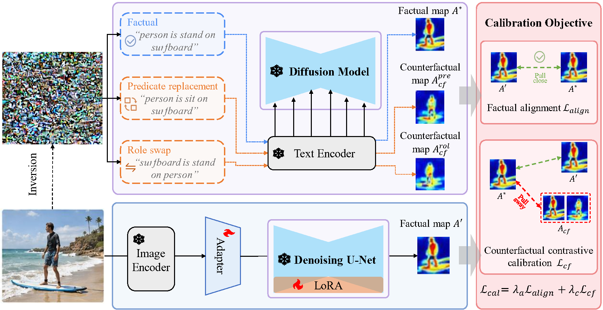
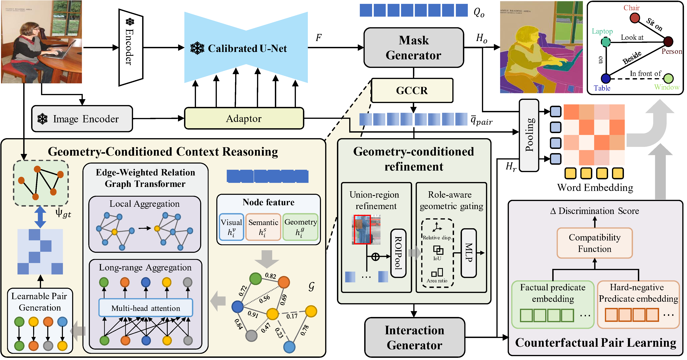

# SPADE++: Geometry-Conditioned Contrastive Reasoning for Open-Vocabulary Scene Graph Generation

This repository is a reference PyTorch implementation of **SPADE++**,
the extension of our ICCV 2025 paper *SPADE*. SPADE++ inherits SPADE's two-stage diffusion-grounded
pipeline and adds a single **counterfactual contrast principle** at two complementary points:

<p align="center">
  
</p>

* **Stage 1 (feature level)** — calibrate a diffusion UNet with both *factual* and
  *counterfactual* cross-attention maps so that the calibrated student becomes a
  *discriminator* among similar attentions, not just a *reproducer* of the correct one.

<p align="center">
  
</p>
  
* **Stage 2 (decision level)** — replace SPADE's hard-thresholded graph and pair selector
  with a soft spatial-semantic graph, an edge-weighted Relation Graph Transformer (RGT),
  union-region RoI-Align refinement and role-aware geometric gating; on top of the relation
  classifier we add a hard-negative pair-discrimination head whose score is fused
  multiplicatively with the standard open-vocabulary classifier.

The codebase deliberately mirrors the structure of our prior CaDM-LQ release so that
researchers familiar with that codebase can navigate this one immediately.

```
SPADE_plus_plus/
├── configs/                # YAML configs for PSG / VG / HICO-DET / V-COCO
├── datasets/               # PSG, VG, HICO-DET dataset wrappers + transforms
├── models/
│   ├── stage1/             # LoRA UNet, DDIM inversion, attention controller, calibration loss
│   └── stage2/             # Soft graph, RGT, pair selector, geometric gating, contrast head
├── sd_extractor/           # Stable-Diffusion UNet wrapper used by both stages
├── run/                    # shell scripts: psg_stage1.sh, psg_stage2.sh, hico.sh, ...
├── tools/                  # auxiliary scripts (CLIP neighbor pre-computation, conversions)
├── util/                   # box ops, misc utilities, logger
├── engine.py               # train/eval engine for both stages
└── main.py                 # CLI entry-point (mirrors CaDM-LQ/main.py)
```

## 1. Background

A relation predicate `p` for a pair `(s,o)` in image `x` is jointly determined by

* a **geometric** configuration `G` (positions, scales, overlaps) and
* a **semantic** context `S` (object identities, scene type).

Web-scale image-text pretraining shapes a backbone's features `Z = f_Z(G,S;θ)`
to encode `S` strongly and `G` weakly, so the predictor `P = f_P(Z)` reads the
predicate from semantic context alone — the **semantic shortcut**. SPADE++ holds
the image fixed and **intervenes on the predicate token** (predicate replacement
or subject-object role swap) to force the model to encode the geometric pathway
it currently neglects.

## 2. Pipeline

### Stage 1 — Feature-level counterfactual calibration

For each training image `x` with `M` ground-truth triples `{(s_i, p_i, o_i)}`:

1. Build a factual relation prompt and run **DDIM inversion** with a *frozen*
   Stable-Diffusion UNet to obtain the factual cross-attention map `A*`.
2. For the `n_cf = 3` pairs with the **largest inter-centroid distance**, build
   counterfactual prompts by (a) *predicate replacement* (top-K=5 CLIP neighbors)
   and (b) *role swap*. Re-run DDIM inversion to obtain counterfactual maps.
3. Train a **LoRA-adapted** student UNet (rank `r=16`) conditioned on a
   `MLP ∘ CLIP_img(x)` adapter (no text prompt is available at inference).

Loss:

```
L_cal = λ_a · L_align + λ_c · L_cf,    (λ_a, λ_c) = (1.0, 0.5)
L_align = (1/|Ω|) Σ_i ‖ A*_i − A'_i ‖_1
L_cf    = (1/|C|) Σ_{A_cf ∈ C} max(0, d(A',A*) − d(A',A_cf) + m),  m = 0.15
```

### Stage 2 — Geometry-conditioned reasoning + decision-level contrast

Calibrated UNet feature `F` →

1. **Mask2Former** instance decoder produces masks `{m_i}` and node features
   `h_i = [h_i^v ‖ h_i^s ‖ h_i^g]`.
2. **Soft graph**: edge weights
   `w_ij = β·σ_s(κ_g g_ij) + (1-β)·σ_s(κ_s cos(h_i^v,h_j^v))`,
   `g_ij = IoU(m_i,m_j) + exp(-‖c_i − c_j‖_2 / τ_g)`.
3. **Edge-weighted RGT** with `√d` scaling, neighbor / non-neighbor split.
4. **Learnable pair selector** `s^pair_rj = σ(q̂_r^T W_p q̂_j + b_p)`.
5. **Union-region refinement** (gated residual on RoI-Align of the union bbox)
   + **role-aware geometric gating** with directional descriptor.
6. **Decision-level contrast** `Δ = σ(f_ψ(h_r,e_p) − f_ψ(h_r,e_{p_cf}))`
   trained by a symmetric BCE.
7. **Score fusion**:
   `P_r^final = (P_r)^α · (P_r')^{1-α} · (Δ̄)^γ`,  `α = 0.34, γ = 0.2`.

## 3. Dependencies

```bash
pip install -r requirements.txt
git clone https://github.com/openai/CLIP.git && cd CLIP && python setup.py develop && cd ..
# Stable Diffusion v1 weights:  https://github.com/runwayml/stable-diffusion
```

CUDA deformable-attention ops (only needed if you also build the deformable transformer
variant for HICO-DET):

```bash
cd models/stage2/ops && python setup.py build install && cd ../../..
```

## 4. Datasets

Supported datasets (see `datasets/`):

| Dataset   | Task            | Wrapper               |
|-----------|-----------------|-----------------------|
| PSG       | Open-vocab PSG  | `datasets/psg.py`     |
| VG        | OV SGG          | `datasets/vg.py`      |
| HICO-DET  | OV HOI det.     | `datasets/hico.py`    |
| V-COCO    | OV HOI det.     | `datasets/vcoco.py`   |

### PSG & VG
[Datasets](https://entuedu-my.sharepoint.com/:f:/g/personal/jingkang001_e_ntu_edu_sg/EgQzvsYo3t9BpxgMZ6VHaEMBDAb7v0UgI8iIAExQUJq62Q?e=fIY3zh) are provided. Please unzip the files if necessary.
```
─ data
   └─ psg_dataset
       ├── coco
       │   ├── panoptic_train2017
       │   ├── panoptic_val2017
       │   ├── train2017
       │   └── val2017
       └── psg
           ├── psg_train_val.json
           ├── psg_val_test.json
           └── ...
```
If you want to play with VG, please download the VG dataset [here](https://entuedu-my.sharepoint.com/:f:/g/personal/jingkang001_e_ntu_edu_sg/EiBEV1Z3ueBJqJVO4j7z0YwBt_Jvj2AqYTRsiIs-8pZowg?e=C2O5yg), and put it into `./data` dir and use pipeline [here](https://github.com/Jingkang50/OpenPSG/blob/main/openpsg/datasets/sg.py) to process the dataset.


### HICO-DET
HICO-DET dataset can be downloaded [here](https://drive.google.com/open?id=1QZcJmGVlF9f4h-XLWe9Gkmnmj2z1gSnk). After finishing downloading, unpack the tarball (`hico_20160224_det.tar.gz`) to the `data` directory.

Instead of using the original annotations files, we use the annotation files provided by the PPDM authors. The annotation files can be downloaded from [here](https://drive.google.com/open?id=1WI-gsNLS-t0Kh8TVki1wXqc3y2Ow1f2R). The downloaded annotation files have to be placed as follows.
```
─ data
   └─ hico_20160224_det
       |─ annotations
       |   |─ trainval_hico.json
       |   |─ test_hico.json
       |   └─ corre_hico.npy
       : 
```

### V-COCO
First clone the repository of V-COCO from [here](https://github.com/s-gupta/v-coco), and then follow the instruction to generate the file `instances_vcoco_all_2014.json`. Next, download the prior file `prior.pickle` from [here](https://drive.google.com/drive/folders/10uuzvMUCVVv95-xAZg5KS94QXm7QXZW4). Place the files and make directories as follows.
```

 ─ data
    └─ v-coco
        |─ data
        |   |─ instances_vcoco_all_2014.json
        |   :
        |─ prior.pickle
        |─ images
        |   |─ train2014
        |   |   |─ COCO_train2014_000000000009.jpg
        |   |   :
        |   └─ val2014
        |       |─ COCO_val2014_000000000042.jpg
        |       :
        |─ annotations
        :
```
The annotation file have to be converted to the HOIA format. The conversion can be conducted as follows.
```
PYTHONPATH=data/v-coco \
        python convert_vcoco_annotations.py \
        --load_path data/v-coco/data \
        --prior_path data/v-coco/prior.pickle \
        --save_path data/v-coco/annotations
```
Note that only Python2 can be used for this conversion because `vsrl_utils.py` in the v-coco repository shows a error with Python3.

V-COCO annotations with the HOIA format, `corre_vcoco.npy`, `test_vcoco.json`, and `trainval_vcoco.json` will be generated to `annotations` directory.


## 5. Usage

```bash
# Stage 1 (PSG)
sh ./run/psg_stage1.sh

# Stage 2 (PSG)
sh ./run/psg_stage2.sh

# HICO-DET zero-shot
sh ./run/hico_zs.sh

# Evaluation
sh ./run/psg_eval.sh
```

## 6. Acknowledgments

This repo is mainly based on [PSG](https://github.com/Jingkang50/OpenPSG), [GEN-VLKT](https://github.com/YueLiao/gen-vlkt), [Mask2Former](https://github.com/facebookresearch/Mask2Former) and [Stable Diffusion](https://github.com/CompVis/stable-diffusion) . We thank their well-organized code!

## 7. Citation
If you find our repository useful for your research, please consider citing our paper:
```bibtex
@inproceedings{hu2025spade,
  title={SPADE: spatial-aware denoising network for open-vocabulary panoptic scene graph generation with long-and local-range context reasoning},
  author={Hu, Xin and Qin, Ke and Duan, Guiduo and Li, Ming and Li, Yuan-Fang and He, Tao},
  booktitle={Proceedings of the IEEE/CVF International Conference on Computer Vision},
  pages={15562--15572},
  year={2025}
}

